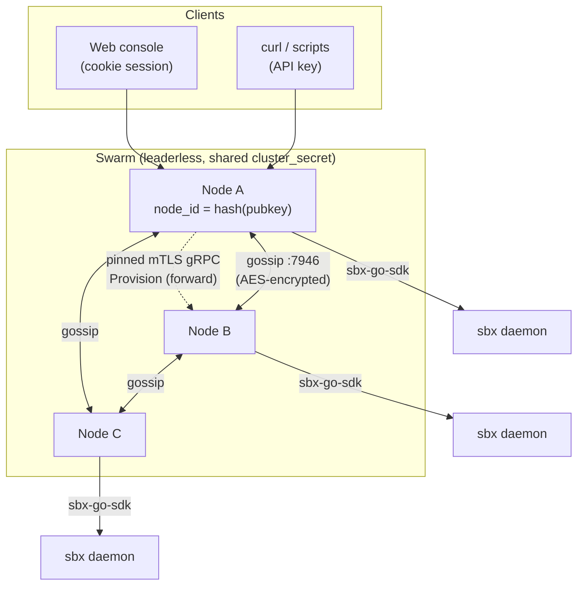
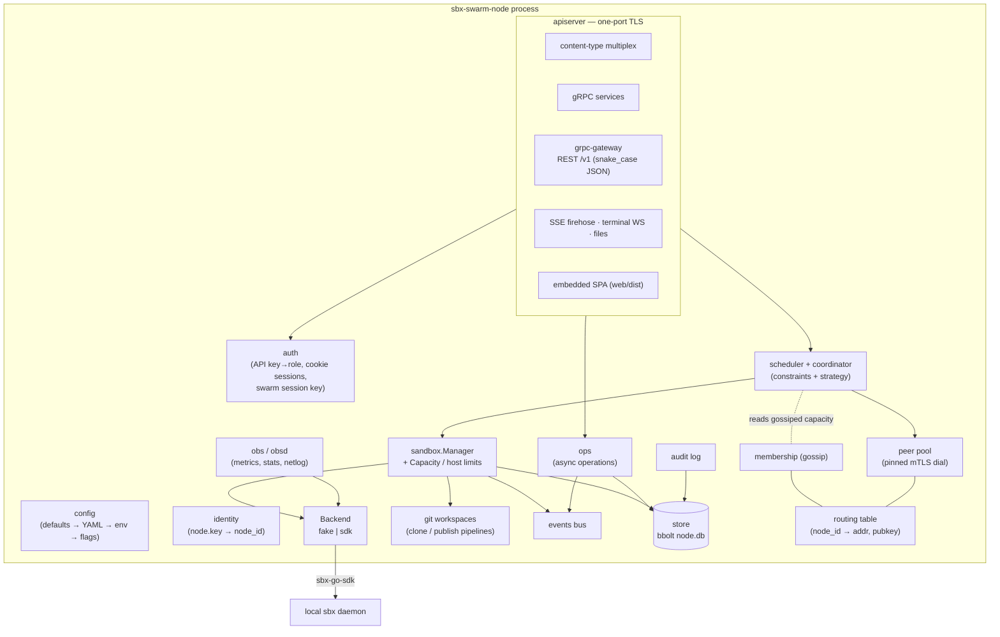
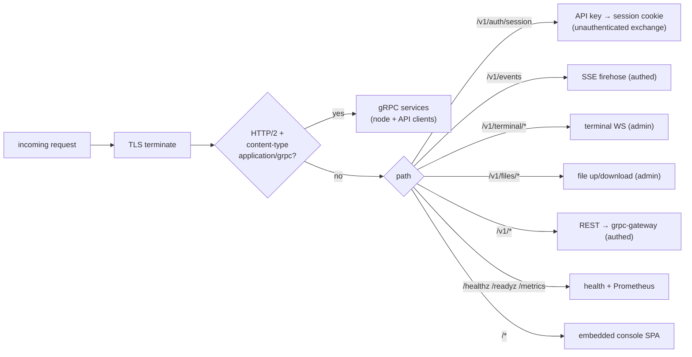
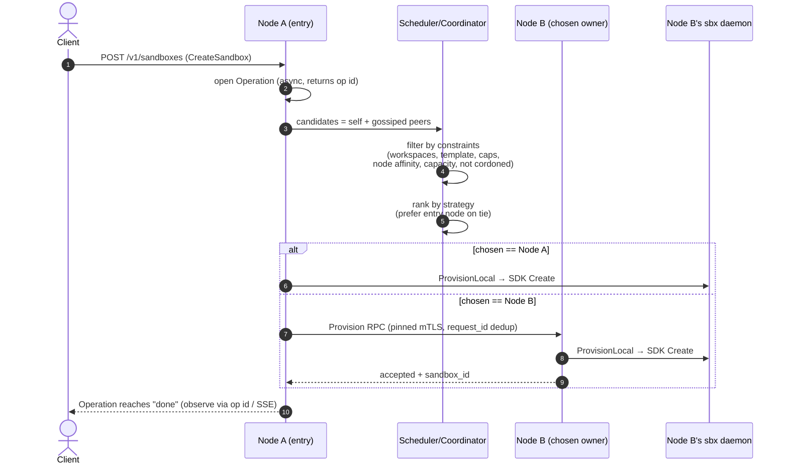
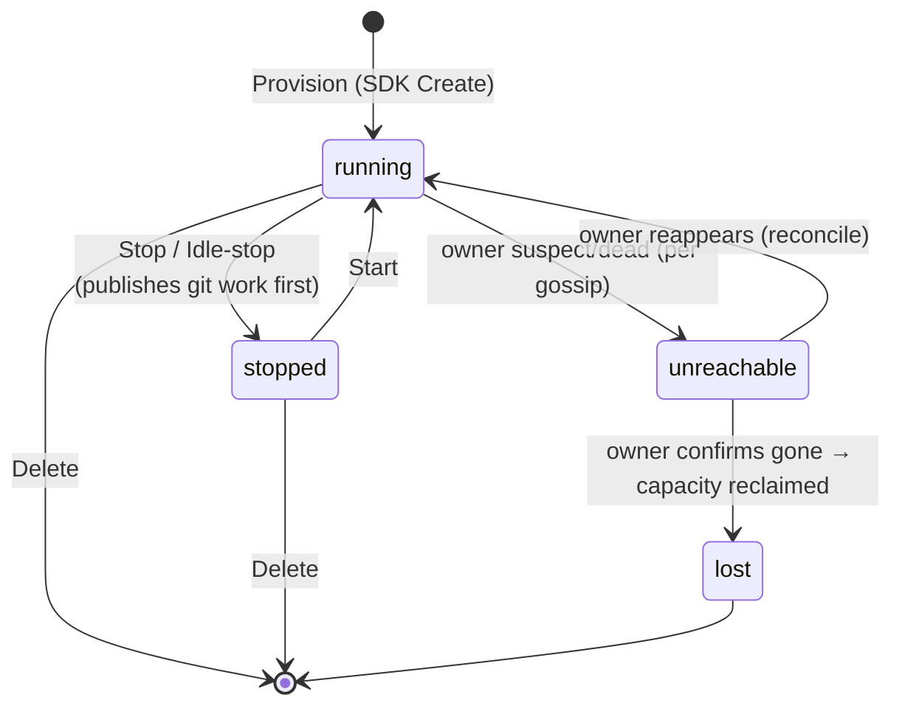

# sbx-swarm-node

A **decentralized control plane for Docker sandboxes**. Each node wraps one host's
local `sbx` sandbox daemon and gossips with its peers to place and manage sandboxes
across the fleet — there is no central controller, no master, no external database.

Run a single node for a swarm-of-one, or point a handful of nodes at each other with
a shared secret and they form a leaderless **swarm**: any node can accept a request,
pick the best host for it, and forward the work there.

> Vocabulary in this project is precise (Node, Swarm, Sandbox, Workspace, Operation,
> Provision…). See [CONTEXT.md](CONTEXT.md) for the full glossary, and
> [docs/adr/](docs/adr/) for the architecture decision records referenced as `ADR-00NN` below.

---

## Table of contents

- [What it does](#what-it-does)
- [Architecture](#architecture)
  - [Swarm topology](#swarm-topology)
  - [Inside one node](#inside-one-node)
  - [The API surface (one node, two listeners)](#the-api-surface-one-node-two-listeners)
  - [How a sandbox gets provisioned](#how-a-sandbox-gets-provisioned)
  - [Sandbox lifecycle](#sandbox-lifecycle)
- [Setup](#setup)
  - [Prerequisites](#prerequisites)
  - [1. Build](#1-build)
  - [2. Single node (quick start)](#2-single-node-quick-start)
  - [3. Forming a swarm](#3-forming-a-swarm)
- [Configuration reference](#configuration-reference)
- [Using it](#using-it)
  - [Authentication](#authentication)
  - [REST quickstart (curl)](#rest-quickstart-curl)
  - [The web console](#the-web-console)
  - [Operations & the event firehose](#operations--the-event-firehose)
- [Security model](#security-model)
- [Repository layout](#repository-layout)

---

## What it does

- **Provision sandboxes anywhere in the swarm.** A request hits any node; a scheduler
  filters hosts by hard constraints (workspaces, template, capabilities, node labels,
  free capacity, not cordoned) and ranks the survivors by strategy (least-loaded,
  bin-pack, spread, least-actual-load). The chosen node creates the sandbox locally.
- **Wraps the real `sbx` daemon** (via [`sbx-go-sdk`](https://github.com/squall-chua/sbx-go-sdk))
  for `backend: sdk`, or a built-in fake for tests / daemonless nodes.
- **Git-backed workspaces.** Provision clones a node-owned bare repo into the sandbox;
  the agent works on a branch; the node runs a configured publish pipeline to push the
  branch back upstream.
- **Headless agent runs, exec, live terminal, file transfer, port publishing.**
- **Idle-stop reaper.** Optionally stops sandboxes with no activity (publishing
  git-backed work first); never deletes them.
- **Observability built in.** Prometheus `/metrics`, an SSE event firehose, per-sandbox
  stats, and a blocked-egress security view.
- **An embedded web console** (Nuxt 4 + @nuxt/ui v4) — sandboxes, nodes, templates,
  workspaces, operations, network, policy/secrets, terminal, and file transfer.

---

## Architecture

### Swarm topology

Nodes are peers. Each owns its host's sandboxes and gossips state (capacity, owned
sandboxes, labels, templates, pinned public keys, cordon/revocation) over an encrypted
[memberlist](https://github.com/hashicorp/memberlist) channel. Clients talk to *any*
node; that node forwards or schedules as needed.



- **Membership & dissemination** — `cluster_secret` both encrypts gossip and gates who
  may join (ADR-0004). Metadata changes propagate fast over UDP; bulk state (owned
  sandbox ids, revocation list) rides TCP push/pull (ADR-0005).
- **Identity** — each node generates an Ed25519 keypair on first run; `node_id` is the
  hash of the public key (self-certifying, ADR-0002). Public keys are pinned across the
  swarm via gossip, and node-to-node RPC uses that pin for mTLS (ADR-0004).
- **Forwarding** — read/stream requests for a sandbox owned elsewhere are proxied to the
  owner; placement of a new sandbox is forwarded as a node-authorized `Provision` RPC
  (ADR-0011).

### Inside one node



Wiring lives in [internal/node/node.go](internal/node/node.go); the entry point is
[cmd/sbx-swarm-node/main.go](cmd/sbx-swarm-node/main.go).

### The API surface (one node, two listeners)

A node serves **two** TLS listeners because the two audiences need different certs
(ADR-0006):

| Listener | Default | Cert | Audience | Surface |
|---|---|---|---|---|
| `listen_addr` | `:8443` | Ed25519 **pinned** identity cert | nodes (peer mTLS) **and** API clients | gRPC + REST `/v1` + SSE + terminal + files + SPA |
| `console_addr` | *(off)* e.g. `:8444` | browser-compatible ECDSA (self-signed or provided) | browsers | everything **except** the gRPC surface |

Browsers reject the pinned Ed25519 cert, so the console gets its own listener. Both
share the same handler logic; only the gRPC port is omitted from the console one.



REST is generated from the protobufs by `grpc-gateway` and emits **snake_case JSON**.
The proto contracts live in [proto/sbxswarm/v1/](proto/sbxswarm/v1/):
`sandbox.proto`, `node.proto`, `policy.proto`, `events.proto`, `internal.proto`.

### How a sandbox gets provisioned



Placement is leaderless and idempotent: a `request_id` dedups retries, and the entry
node is preferred on a score tie (ADR-0007). Cross-node creates go through one
owner-side chokepoint, `ProvisionLocal` (ADR-0015), so local and remote provisioning
share identical admission and git-clone logic.

### Sandbox lifecycle



`unreachable` is a peer's non-destructive guess; only the owner ever declares `lost`
(terminal). Idle-stop only ever moves `running → stopped` and never deletes
(ADR-0016) — reserved capacity is unchanged, but host CPU/memory are freed.

---

## Setup

### Prerequisites

- **Go 1.25+** (see [go.mod](go.mod)).
- For `backend: sdk` — a running, **version-compatible `sbx` daemon** on the same host
  (this code targets `sbx-go-sdk v0.1.6` / daemon api ≈ v0.12.0; the SDK does a strict
  version handshake and the node fails to boot on mismatch). For everything else,
  `backend: fake` needs no daemon.
- To rebuild the console: **Node.js + npm** (Nuxt 4). The repo ships a prebuilt
  `web/dist`, so this is only needed if you change the UI.

### 1. Build

The console SPA is embedded into the binary at build time.

```bash
# Build the console + the node binary
make build          # == web/scripts/build.sh (nuxi generate → web/dist) then `go build ./...`

# Just the Go binary (uses the already-built web/dist)
go build -o sbx-swarm-node ./cmd/sbx-swarm-node

# Run the tests
go test ./...
```

> `make web` rebuilds only `web/dist`; `make build` rebuilds the SPA and then the
> binary so the latest console is embedded.

### 2. Single node (quick start)

Create `config.yaml`:

```yaml
# config.yaml — single standalone node (a swarm of one)
node_name: dev-node
data_dir: ./data            # node.key, node.db, swarm.json, console certs land here
listen_addr: ":8443"        # node + API-client listener (pinned Ed25519 cert)
log_level: info

# Browser console on a separate, browser-compatible listener.
console_addr: ":8444"       # open https://localhost:8444/
console_tls: true           # self-signed ECDSA cert under data_dir/console (browser warning is expected)

# "sdk" drives the real sbx daemon; switch to "fake" if you have no daemon.
backend: sdk

# Bearer keys → roles. Two roles only: admin (full) and read-only.
api_keys:
  - key: "change-me-admin"
    role: admin
  - key: "change-me-readonly"
    role: read-only

# The SDK requires at least one workspace to provision.
workspaces:
  - name: scratch
    host_path: /srv/sbx/scratch     # operator-managed host directory
    read_only: false
```

Run it:

```bash
./sbx-swarm-node --config config.yaml
# → node serving on :8443, console serving on :8444
```

Open `https://localhost:8444/`, accept the self-signed cert, and log in with the admin
key. (No console? Drop `console_addr` and use the REST API on `:8443`.)

### 3. Forming a swarm

A swarm needs a **shared `cluster_secret`** (encrypts gossip + gates joins). The first
node mints the swarm identity; the rest list it (or any member) under `join`.

**Seed node** (`node-a.yaml`):

```yaml
node_name: node-a
data_dir: /var/lib/sbx/node-a
listen_addr: "0.0.0.0:8443"     # reachable by peers
gossip_addr: "0.0.0.0:7946"
backend: sdk

cluster_secret: "a-long-random-shared-secret"   # SAME on every node
swarm_name: prod

api_keys:
  - { key: "admin-key", role: admin }

# Advertise this host's labels so requests can target it (zone/rack/gpu/…).
labels:
  zone: us-east-1a

workspaces:
  - { name: scratch, host_path: /srv/sbx/scratch }
```

**Joining node** (`node-b.yaml`):

```yaml
node_name: node-b
data_dir: /var/lib/sbx/node-b
listen_addr: "0.0.0.0:8443"
gossip_addr: "0.0.0.0:7946"
backend: sdk

cluster_secret: "a-long-random-shared-secret"   # MUST match node-a
join:
  - "node-a.internal:7946"        # seed = any existing member's gossip_addr

api_keys:
  - { key: "admin-key", role: admin }            # API keys are swarm-wide (ADR-0010)

labels:
  zone: us-east-1b

workspaces:
  - { name: scratch, host_path: /srv/sbx/scratch }
```

Start the seed first, then the joiner. They discover each other over gossip, pin each
other's keys, and share capacity for scheduling. Notes:

- **Don't** set `tls_cert_file` / `tls_key_file` on a clustered node — clustering uses
  the node-key-derived pinned cert and the two are mutually exclusive (validation
  rejects it, ADR-0004).
- API keys are intentionally identical across the swarm (one admin key works on any
  node, ADR-0010).
- `listen_addr: ":8443"` (no host) auto-resolves to `127.0.0.1:8443` for advertising,
  which is fine for loopback tests but **set a concrete reachable host/IP in production**.

---

## Configuration reference

Config is layered: **defaults → YAML file (`--config`) → env vars (`SBX_…`) → flags**,
each overriding the previous. Schema: [internal/config/config.go](internal/config/config.go).

| Key | Type | Default | Notes |
|---|---|---|---|
| `node_name` | string | hostname | Operator display name. |
| `data_dir` | string | `./data` | Holds `node.key`, `node.db` (bbolt), `swarm.json`, `console/` certs. |
| `listen_addr` | string | `:8443` | Node + API-client TLS listener (pinned Ed25519). |
| `console_addr` | string | *(off)* | Browser console listener; empty disables it. |
| `console_tls` | bool | `true` | `false` → plain HTTP (front with a TLS proxy / trusted network only). |
| `console_tls_cert_file` / `console_tls_key_file` | string | *(self-signed)* | Provide a real browser cert to avoid the warning. |
| `tls_cert_file` / `tls_key_file` | string | *(node-key cert)* | Standalone only — **incompatible with `cluster_secret`**. |
| `log_level` | string | `info` | `debug` \| `info` \| `warn` \| `error`. |
| `backend` | string | `fake` | `fake` (no daemon) \| `sdk` (real `sbx` daemon; fails boot if it can't connect). |
| `api_keys[]` | list | – | `{ key, role }`, role = `admin` \| `read-only`. |
| `cluster_secret` | string | – | Enables gossip; encrypts it and gates joins. Same on every node. |
| `join[]` | list | – | Seed `host:gossip_port` entries. Requires `cluster_secret`. |
| `swarm_name` | string | – | Human label for the swarm. |
| `gossip_addr` | string | `:7946` | memberlist bind address. |
| `labels{}` | map | – | This node's labels for affinity/anti-affinity placement. |
| `workspaces[]` | list | – | Named host dirs to mount/clone. At least one is required to provision via the SDK. |
| `provision_limits` | `{cpu_cores, memory_bytes, disk_gb}` | auto-detected | Caps the capacity this node offers the swarm. `0` → auto-detect host. |
| `default_strategy` | string | `least-loaded` | `least-loaded` \| `bin-pack` \| `spread`. (Requests may also ask for `least-actual-load`.) |
| `default_sandbox_resources` | `{cpu_cores, memory_bytes, disk_gb}` | – | Applied when a request omits a resource. |
| `idle_timeout` | duration | *(off)* | e.g. `30m`; enables the idle-stop reaper. Empty/`0` disables it. |
| `max_upload_bytes` | int64 | 100 MiB | Per-request file-upload ceiling. |

**Workspace** (`workspaces[]`):

```yaml
workspaces:
  - name: scratch
    host_path: /srv/sbx/scratch
    read_only: false

  # Git-backed (clone-only, ADR-0015): the agent works in a fresh clone on a branch.
  - name: my-repo
    host_path: /srv/sbx/repos/my-repo.git    # a node-owned bare/mirror repo
    git:
      remote: origin
      default_branch: main
      allow_push: true            # required for Publish; omit/false = clone & work, never push back
      # {remote}, {branch}, {sandbox_remote} are substituted at run time.
      pre_steps:
        - ["git", "fetch", "{remote}", "+refs/heads/*:refs/heads/*"]
      publish_steps:
        - ["git", "fetch", "{sandbox_remote}", "+refs/heads/{branch}:refs/heads/{branch}"]
        - ["git", "push", "{remote}", "{branch}"]
      exec_allowlist: ["git", "git-lfs"]      # commands the pipeline may run
```

A git-backed workspace is always mounted **read-only** into the sandbox — the agent
works in its clone, never the base repo (ADR-0015). Upstream credentials are host-side
git config, never in this file (ADR-0014).

**Environment / flags** (override the YAML):

```bash
SBX_NODE_NAME, SBX_DATA_DIR, SBX_LISTEN_ADDR, SBX_CONSOLE_ADDR, SBX_LOG_LEVEL

--config <path>  --node-name  --data-dir  --listen-addr  --console-addr  --log-level
```

---

## Using it

### Authentication

- **API clients** send `Authorization: Bearer <api_key>`. The key maps to a role:
  `admin` (full) or `read-only` (reads only; mutations are rejected).
- **Browsers** exchange a key for a signed session cookie at `POST /v1/auth/session`,
  then send the cookie (ADR-0006). The signing key is derived per-swarm so a cookie
  works on any node (ADR-0010).
- **Terminal and file transfer are admin-only**, even with a valid read key.

### REST quickstart (curl)

`-k` accepts the self-signed cert. All `/v1` JSON is snake_case.

```bash
NODE=https://localhost:8443
KEY=change-me-admin

# Who am I / which node is this? (role is echoed back)
curl -sk $NODE/v1/node -H "Authorization: Bearer $KEY"

# List nodes in the swarm (capacity, labels, templates, cordon state)
curl -sk $NODE/v1/nodes -H "Authorization: Bearer $KEY"

# Provision a sandbox (returns an Operation; placement is async)
curl -sk -X POST $NODE/v1/sandboxes -H "Authorization: Bearer $KEY" \
  -H 'Content-Type: application/json' \
  -d '{
        "cpus": 2,
        "memory_bytes": 2147483648,
        "workspaces": [{"name": "scratch", "read_only": false}],
        "strategy": "least-loaded",
        "node_affinity": {"zone": "us-east-1a"}
      }'

# List / inspect sandboxes
curl -sk $NODE/v1/sandboxes -H "Authorization: Bearer $KEY"
curl -sk $NODE/v1/sandboxes/<id> -H "Authorization: Bearer $KEY"

# One-shot command inside a running sandbox
curl -sk -X POST $NODE/v1/sandboxes/<id>/exec -H "Authorization: Bearer $KEY" \
  -H 'Content-Type: application/json' -d '{"cmd": ["echo", "hello"]}'

# Stop (keeps it) vs delete (removes it)
curl -sk -X POST   $NODE/v1/sandboxes/<id>/stop   -H "Authorization: Bearer $KEY"
curl -sk -X DELETE $NODE/v1/sandboxes/<id>        -H "Authorization: Bearer $KEY"
```

Other surfaces from the protos: `template`/`node` listing, port publish/list/unpublish,
per-sandbox `stats`, blocked-egress (`/blocked`), git `branches` + `publish`, agent runs,
`keepalive`, and policy/secrets. See [proto/sbxswarm/v1/](proto/sbxswarm/v1/) for the
exact paths and fields.

### The web console

Build it into the binary (`make build`), set `console_addr`, and browse to it. Pages:

| Page | What |
|---|---|
| Sandboxes | List/provision/start/stop/delete; terminal; files; ports; stats; git publish. |
| Nodes | Swarm capacity, labels, templates; cordon / uncordon / drain / revoke. |
| Templates | Per-node base images available for provisioning. |
| Workspaces | Catalog of advertised workspaces (advertisers, git tri-state, mounts). |
| Operations | Async operation history and state. |
| Network | Published ports and blocked-egress security view. |
| Settings | Policy rules and secrets (stored + per-sandbox). |

Develop the UI live with `cd web && npm run dev` (proxies to a running node).

### Operations & the event firehose

Mutations (provision, stop, remove, agent run, git publish) are **Operations**: the call
returns an operation id and you observe progress rather than blocking. Stream everything
happening on the swarm over Server-Sent Events:

```bash
curl -Nsk https://localhost:8443/v1/events -H "Authorization: Bearer $KEY"
```

The firehose is **best-effort, not a durable log** (ADR-0008) — use it for live UI and
notifications, not as a source of truth.

---

## Security model

- **Node identity is self-certifying** — `node_id = hash(Ed25519 pubkey)`; the private
  key lives in `data_dir/node.key` (mode `0600`). Don't copy a data dir between hosts.
- **Gossip is encrypted** with `sha256(cluster_secret)` as an AES-256 key; the secret
  also gates membership (ADR-0004).
- **Node-to-node RPC is pinned mTLS** — peers authenticate against the gossiped public
  key, and the internal `Provision` RPC is node-authorized (ADR-0011).
- **Revocation** — an operator can place a `node_id` on a swarm-wide denylist (gossiped,
  eventually consistent, ADR-0013); a revoked node's calls are rejected until it
  generates a new key. Distinct from **cordon**, which only stops *new* placements on a
  still-trusted node.
- **Roles** — `admin` vs `read-only`; terminal and file transfer require admin.
- **`console_tls: false` serves cleartext** — only behind a TLS proxy or on a trusted
  network.

---

## Repository layout

```
cmd/sbx-swarm-node/      entry point (main.go)
internal/
  config/                layered config loading + validation
  identity/              node keypair → node_id (node.key)
  store/                 bbolt-backed KV persistence (node.db)
  sandbox/               Manager, Backend (fake|sdk), Capacity, host-limit detection
  scheduler/             placement constraints + ranking strategies
  coordinator/           provision attempt orchestration (local or remote)
  membership/            gossip cluster (hashicorp/memberlist), swarm identity
  routing/               node_id → addr / pubkey table
  peer/                  pinned-mTLS gRPC peer pool + node-key creds
  nodekey/               node-key auth + denylist
  apiserver/             one-port TLS server: gRPC + REST gateway + SSE + terminal + files + SPA
  auth/                  API key→role, session cookies, swarm session key
  audit/                 audit log
  events/                event bus / SSE firehose
  ops/                   async Operation tracking
  obs/, obsd/            metrics, health, stats + netlog collectors
  git/                   git-backed workspace clone/publish pipelines
  ids/, tlsutil/         id generation, TLS cert helpers
  gen/                   generated protobuf/gRPC/gateway code
proto/sbxswarm/v1/       service + message contracts (buf)
web/                     Nuxt 4 + @nuxt/ui v4 console (embedded via web/embed.go)
docs/adr/                architecture decision records
CONTEXT.md               domain glossary (read this for precise terminology)
```

Protobufs are generated with [buf](https://buf.build) — see [buf.gen.yaml](buf.gen.yaml).
